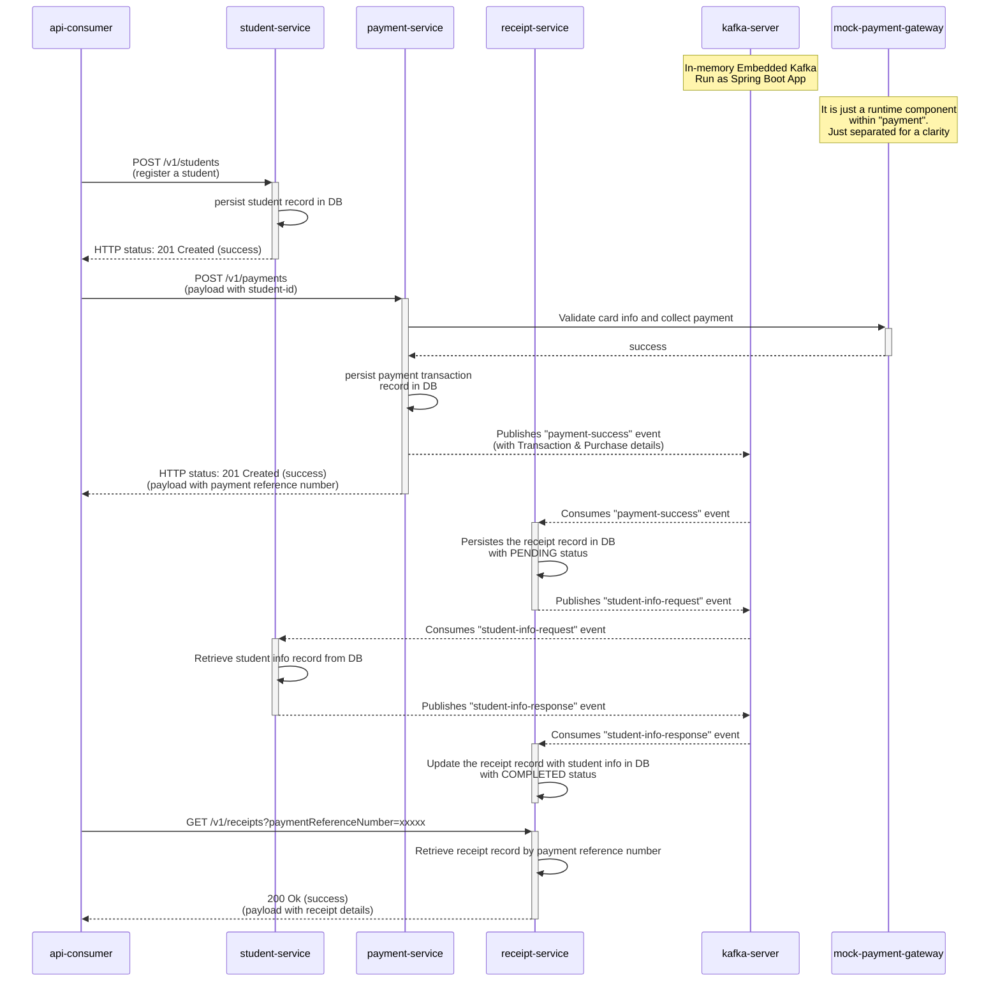

# Payment system using DDD - Learning purpose.

### Table of Contents
- [Introduction](#introduction)
- [Pre-requisite](#pre-requisite)  
- [Module anatomy](#module-anatomy)
- [Local Run](#local-run)
- [Sequence Diagram](#sequence-diagram)
- [Steps to verify the flow](#steps-to-verify-the-flow)
- [Design Decisions](#design-decisions)
- [Assumptions](#assumptions)
- [In-progress items](#in-progress-items)

## Introduction

A student management and fee collection system. Consists of 3 micro-services for student, payment & receipt domains 
and a supporting Kafka server.

## Pre-requisite

Please make sure your machine has the following things installed,
- IDE: IntelliJ IDEA (preferred)
  - `Java 17` (can be installed easily using IDE if you have one)
  - `Maven 3.8.*` (again comes bundled with most of the IDE)
  - Check out this project as a whole
    - It is a multi-module mono-repo consisting of all the required modules together.
  - Select maven's `clean install` goals from the maven section of the IDE
  
  (or)

- If you prefer a terminal, you can use `mvnw` (maven wrapper) that comes with this repository itself
  - `./mvnw clean install` from the root of the directory to build all the modules.

## Module anatomy
  - All the common modules are grouped under the `common` maven module.
  - Service modules are suffixed with `**-service` & `**-server`
    - can be run individually
  - The `kafka-server` module is an `Embedded Kafka` setup using spring-boot. And it is good enough for this demo app.
    - All the required Kafka `topics` are created automatically when it is up.
    - It is visible only on `localhost` and not configured for remote execution.
    - Message serialization: `Json` serializer is used for messages. Due to the demo app, we haven't gone with `Avro` format
    & `schema-registry`.
 
## Local Run 
Steps to locally run the required applications,
  - Please run the below services,
    - Using maven wrapper (maven wrapper doesn't need maven installation locally)
      - Step 1: Open `terminal` and move to the `skiply-system` directory
        - `cd {your-location}/skiply-system` 

      - Step 2: Run each of the below commands on a separate terminal,
        - `./mvnw clean spring-boot:run --file ./kafka-server/pom.xml`  - recommended to start this first
        - `./mvnw clean spring-boot:run --file ./student-service/pom.xml`
        - `./mvnw clean spring-boot:run --file ./payment-service/pom.xml`
        - `./mvnw clean spring-boot:run --file ./receipt-service/pom.xml`

       **(or)**

    - Using IDE as a spring boot application,
      - `kafka-server` - recommended to start this first.
      - `student-service`
      - `payment-service`
      - `receipt-service`
      
         (Optional) you may also compound these runs into single units as shown below,
             

  - Once all the services are up & running, then go to the service-specific Swagger UI to execute the flows as 
described below.

## Sequence Diagram

## Steps to verify the flow

- **Step 1**: Register a student using student-service's post endpoint (Assumption: Student ID has to be provided to register).
  - Go to [student-service's README.md](./student-service/README.md#api-documentation)

- **Step 2**: Make a payment for the registered student. Again you should get `201` and a `paymentReferenceNumber` as a response.
  Note: `IdempotencyKey` has to be unique for each transaction to maintain the idempotency of the payment request.
  - Go to [payment-service's README.md](./payment-service/README.md#api-documentation)

- **Step 3**: Retrieve the receipt using `paymentReferenceNumber`
  - Go to [receipt-service's README.md](./receipt-service/README.md#api-documentation)

## Design Decisions
- To aggregate data from multiple services, the approach I took here is 
[CQRS pattern](https://microservices.io/patterns/data/cqrs.html). 
  - For instance, `receipt-service` needs data from `student-service` & `payment-service`. The flow is,
    - `payment-service` emits an event to `kafka` with the required information once payment is collected successfully.
    - `receipt-service` then consumes it and loads the data in a format it needs (since the payment data is immutable 
    once created). It is perfectly fine to capture and store locally in a structure it needs.
    - Once payment-related information persists in the `receipt-service`'s local DB, it will request  
    the student info. It is achieved by the request-response event model using `kafka`.
    - Both payment & student information required for receipt will be stored locally in an expected format.
- Due to time constraints I haven't used the 
[Outbox pattern](https://microservices.io/patterns/data/transactional-outbox.html) before publishing the events.
- Used `@RequiredArgsConstructor` for constructor injection
- Two types of service classes may have been used in some parts of the service to comply with the **DDD** approach 
  - `**ApplicationService` class - to execute application-level business logic (aka `UseCase` classes)
  - `**DomainService` class - to execute Domain business logic.
    - **Optional** if only one **AggregateRoot** is involved. Ex: `student-service`. 
    - It is only applicable when two or more **AggregateRoots** have to be accessed and orchestrated to execute 
    Domain logic (**DDD** concept).
  - Used **ValueObjects** to embrace domain-driven concepts and set meaningful types (**DDD** concept).
    - ex: `StudentId`, etc
  - I used `Lombok` annotations in the Domain classes due to time constrain. Usually, it will be made up of 
  pure Java code without any dependency on external libs or frameworks.

## Assumptions
- Student numbers will be unique across the schools. So, make it as primary key after the required validations.
  - Otherwise, we need to maintain an internal student ID within our system to make it unique.
- The payment service doesn't validate the student ID as a registered one before making payment. It was clarified 
before doing this assignment.
